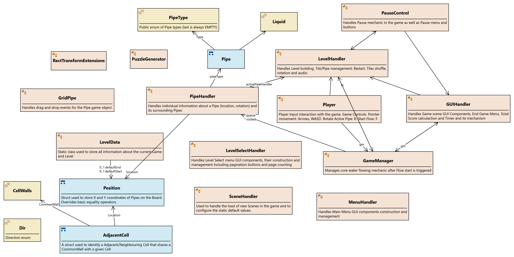

# Documentation

## Table of Contents

- [Overview](#overview)
    - [Game Mechanics](#game-mechanics)
    - [Board Setup](#board-setup)
    - [Pipes](#pipes)
    - [Flowing Mechanic](#flowing-mechanic)
    - [Score Calculation](#score-calculation)
    - [Level Progression](#level-progression)
    - [Game Modes](#game-modes)
    - [Game Flow](#game-flow)
- [Unity Project Structure](#unity-project-structure)
    - [Folders](#folders)
    - [Assets](#assets)
- [Technical details](#technical-details)
    - [Script (Class) Diagram](#script-class-diagram)
- [Scenes](#scenes)
    - [Level Select Menu](#scene-levelselect)
    - [Game Scene](#scene-game)
- [Build, Install, and Run](#build-install-and-run)
- [Credits and 3rd Party Assets](#credits-and-3rd-party-assets)

## Overview
Pipe World is a puzzle game developed in Unity 2021.3.5f1 using C# scripting language. The game is designed for the WebGl platform and is inspired by popular puzzle games such as Pipe Mania and Water Pipes. The player's goal is to transport liquid from one end of the game board to the other using interconnected pipes.

### Game Mechanics
The game consists of a static matrix-like game board that contains randomly rotated pipes of different types, including straight, right-bent/left-bent, three-way, and cross. The player can rotate a pipe by clicking on it. The player must create a connection with nearby pipes to transport the liquid/water from one edge of the board to the other edge. The player has a set time limit during which they can rotate pipes. The earlier the player finishes, the more total score they receive. After every second level, the game board gets bigger, or the time limit is changed to reflect the increasing difficulty of the level.

### Board Setup
Upon starting the game, the player is presented with a game board that consists of a matrix-like grid, where the pipes are randomly placed and rotated. The player must connect the pipes in order to create a continuous path from the start pipe to the end pipe.

### Pipes
There are four types of pipes: straight, right-bent/left-bent, three-way, and cross pipes. These pipes are randomly placed on the game board and the player must rotate them by clicking on them until they are connected to the adjacent pipes.

### Flowing Mechanic
The objective of the game is to create a continuous path from the start pipe to the end pipe, allowing water to flow through the connected pipes. The water flows through the pipes automatically once the Flow button is pressed. The player has a limited amount of time to connect the pipes before the water begins to flow. If the player fails to connect the pipes before the time limit expires, the game ends.

### Score Calculation
The game score is calculated based on the time it takes the player to connect the pipes and complete the level. The faster the player completes the level, the higher the score. The score is also affected by the number of pipes the player has used to complete the level. The fewer pipes the player uses, the higher the score.

### Level Progression
After completing a level, the player is presented with the option to advance to the next level. As the player progresses through the levels, the game board becomes larger and more complex, and the time limit becomes shorter, making it more challenging to complete the levels.

### Game Modes
There are two game modes in Pipe World: Arcade Mode and Level Select Mode. In Arcade Mode, the player must complete as many levels as possible in a given time. In Level Select Mode, the player can choose to play any of the available levels.

### Game Flow

1. Main Menu

    When the game is launched, the player is presented with the Main Menu. The Main Menu contains two buttons: Play and Quit. Clicking on Play takes the player to the Level Select Menu.

2. Level Select Menu 

    The Level Select Menu contains a paginated list of available levels that the player can choose to play. Each level displays the level number, the number of pipes used, and the time limit. Clicking on a level takes the player to the Game Scene with the selected level loaded.

3. Game Scene 

    The Game Scene is where the player can play the game. The game board is displayed in the center of the screen, and the GUI components are displayed on the sides of the screen. The player can rotate the pipes by clicking on them, and start the water flow by clicking the Flow button. The player can pause the game by clicking on the Pause button.

4. Pause Menu 

    When the game is paused, the Pause Menu is displayed. The Pause Menu contains two buttons: Resume and Quit. Clicking on Resume returns the player to the Game Scene. Clicking on Quit takes the player back to the Main Menu.

5. End Game Menu 

    When the player completes a level or runs out of time, the End Game Menu is displayed. The End Game Menu displays the player's score, the number of pipes used, and the time taken to complete the level. The End Game Menu contains two buttons: Retry and Quit. Clicking on Retry restarts the level. Clicking on Quit takes the player back to the Level Select Menu.

***

## Unity Project Structure

### Folders:
- **Assets** - scripts, pictures, sprites, audio, animations and user-made files
- **Packages** - contains information about required packages to install and build the Unity project
- **ProjectSettings, UserSettings** - contains Project settings and custom Unity Editor preferences

### **Assets**
- **Animations** (Controllers have just a default implementation)
    - PointerAnimation - red-invisible Pointer animation that points at the current active tile
    - SkipAnimation - Skip button animation to make it flicker
    - Start Flow Animation - Flow button animation to make it flicker
- **Prefabs** (Instantiated and configured in scripts)
    - BackTile Prefab - Background tile used in Grid for the individual Pipes
    - Pointer Prefab - Instantiated on the grid as pointing/marking tool
    - **AudioSources** - Audio Source Prefabs with Audio Clips used for button clicking, hovering, pipe rotation and End Game win sound respectively
    - **Buttons** - Level Select button Prefabs used in pagination for Next Page and Previous Page buttons
    - **Pipes** - Default Pipe Prefabs with default green sprites with pre-set *tileType* and *IODirs* for respective Pipe types (except for EMPTY Pipe)
- **Puzzle stage & settings GUI Pack**[^1] - A Unity Asset Store GUI Pack used for labels, buttons, Pause and End Game menus
- **Resources** (Uses custom Unity API for access)
    - LevelX - Custom level data accessible from Level Select menu, new level can be added easily following this pattern:
        - First row: Grid row/column length
        - Second row: Default *TimeLimit*
        - GameBoard:
            - Each cell in the matrix is divided by semicolon ';'
            - The first symbol can be either: S = StartPipe, E = EndPipe, 0 = Any other Pipe
            - Symbols are separated by ':'
            - The second symbol/number can be either: 0 = No pipe, 1 = Straight pipe, 2 = Round, 3 = ThreeWay, 4 = Cross
            - Each row has to be finished with another semicolon ';'
    - **Sounds** - Audio Clips[^4] used in *AudioSources* Prefabs
    - **UI** - Additional Sprite and Font data used in-game
- **Scenes**
    - *Game* - Main Game scene where all the mechanics and physics occur, either chosen *LevelX* from Level Select menu or Arcade mode
    - *LevelSelect* - All levels included in Resources are automatically added to the Level Select menu in a paginated view
    - *MainMenu* - First scene in Build with 2 buttons
- **Scripts** (Only MonoBehaviour scripts attached to GameObjects) - more documentation can be found in the code *comments*
    - *Extensions.cs* - Used only to extend RectTransform methods by adding an amount of screen units to left/right/top/bottom offset
    - *GameManager.cs* - Manages core water flowing mechanic after Flow start is triggered
    - *GUIHandler.cs* - Handles *Game* scene GUI Components, End Game Menu, Total Score calculaction and Timer and its mechanism
    - *LevelData.cs* - Static class used to store all information about the current Game and Level
    - *LevelHandler.cs* - Handles Level building, Tile/Pipe management, Restart, Tiles shuffle, rotation and audio
    - *LevelSelectHandler.cs* - Handles Level Select menu GUI components, their construction and management including pagination buttons and page counting
    - *MenuHandler.cs* - Handles Main Menu GUI components construction and management
    - *PauseControl.cs* - Handles Pause mechanic in the game as well as Pause menu and buttons
    - *PipeHandler.cs* - Handles individual information about a Pipe (location, rotation) and its surrounding Pipes
    - *Player.cs* - Player Input interaction with the game. Game Controls.
    - *PuzzleGenerator.cs* - Static class used to generate a maze puzzle consisting of cells that are surrounded by walls in a 2D Array made by CellWalls struct
    - *SceneHandler.cs* - Used to handle the load of new Scenes in the game and to configure the static default values
- **Settings** - Universal Render Pipeline default settings (not used extensively in the project)
- **Sprites**
    - Square.png - Used for Marker animation
    - **BackTiles** - BackTiles[^2] used in Grid, that are chosen at random when the game starts
    - **PipeTiles** - Green Pipes and Red Pipes[^3] as well as their water- variants
- **TextMesh Pro** - A Unity plugin used in all TextMeshPro components
- **UI Toolkit** - Not used in the project, just the default UI settings

***

## Technical details
All scripts attached to GameObjects inherit from the base MonoBehaviour class in Unity. MonoBehaviour is a class that allows the user to attach scripts to GameObjects in the Unity Editor. The MonoBehaviour class contains several methods that are called at specific moments in the game loop. These methods are called in the following order:
1. Awake
2. Start
3. Update
4. LateUpdate
5. FixedUpdate

### Script (Class) Diagram

Check out individual **Script Docs** for more information:

1. [GameManager.cs](/scripts-docs/GameManager.md)
2. [GUIHandler.cs](/scripts-docs/GUIHandler.md)
3. [LevelHandler.cs](/scripts-docs/LevelHandler.md)
4. [PauseControl.cs](/scripts-docs/PauseControl.md)
5. [PipeHandler.cs](/scripts-docs/PipeHandler.md)
6. [Player.cs](/scripts-docs/Player.md)
7. [PauseControl.cs](/scripts-docs/PauseControl.md)
8. [MenuHandler.cs](/scripts-docs/MenuHandler.md)
9. [LevelSelectHandler.cs](/scripts-docs/LevelSelectHandler.md)
10. [DragAndDrop/GridPipe.cs](/scripts-docs/DragAndDrop/GridPipe.md)
11. [StaticClasses/Extensions.cs](/scripts-docs/StaticClasses/Extensions.md)
12. [StaticClasses/LevelData.cs](/scripts-docs/StaticClasses/LevelData.md)
13. [StaticClasses/PuzzleGenerator.cs](/scripts-docs/StaticClasses/PuzzleGenerator.md)
14. [StaticClasses/SceneHandler.cs](/scripts-docs/StaticClasses/SceneHandler.md)

***

## Scenes

### **Scene: LevelSelect**
Scene contains a Title and a Grid of Levels in a paginated view.  

- **Main Camera** - A *LevelSelectHandler.cs* is attached to the Camera.
    - Inspector view and *LevelSelectHandler.cs* settings:
        - *Previous Page Btn*: Reference to the *Previous Page Btn* Prefab in *</Assets/Prefabs/Buttons>*
        - *Next Page Btn*: Reference to the *Next Page Btn* Prefab in *</Assets/Prefabs/Buttons>*
        - *Level Btn Background* - Reference to the *candy bar* Sprite in *</Assets/Puzzle stage & settings GUI Pack/Image_green>*
        - *Numbers* - Reference to the respective number Sprite in *</Assets/Puzzle stage & settings GUI Pack/Image_green/text>*
        - *Levels Count*: When the number of Levels in Resources changes, this number should be changed to reflect the current number of Levels.
- **Audio Click Source** - Audio Source used in scripts when a button is clicked
- **Audio Enter Source** - Audio Source used in scripts when a mouse hovers over a button
- **Level Select Canvas** - The Canvas is rendered upon the Main Camera (referenced in Inspector)
    - *Canvas Scaler* - Used for Responsive design that scales the width and height (***Screen Match Mode***) equally (***Match*** = 0.5) using the 1920x1080 resolution as a reference point
    - **Page #** - Represents a collection of at most 8 *Level Numbers* all organized using the *Grid Layout Group*
        - *Grid Layout Group* - Childs are aligned along the middle center line using fixed *Cell Size* and *Spacing* values
        - **# (Buttons)** - Are all Interactable button parents
            - **Number#** - Contains *Horizontal Layout Group* component to organize multi-digit Numbers one by one; Also has custom padding
    - **Previous Page Btn(Clone)**, **Next Page Btn(Clone)** - An instantiated prefab that represents a cloned button that changes ***Interactable*** property when the *currentPage* is either the *Last Page* or *First Page*

### **Scene: Game**
Game scene is the main scene in the build.  

- **Grid** - A *LevelHandler.cs* script is attached to Grid GameObject.
    - Inspector view and *LevelHandler.cs* settings:
        - *Pipe Prefabs* - Referenced from the *</Assets/Prefabs/Pipes>* directory; The last one is always EMPTY
        - *Pipe Sprites*, *Filled Pipe Sprites*, *Red Pipe Sprites*, *Filled Red Pipe Sprites* - all respectively referenced using the spritesheets in *<Assets/Sprites/PipeTiles>*
        - *Tile Pointer* - Referenced ***Pointer*** Scene GameObject
        - *Back Tile Prefab* - Referenced from the *</Assets/Prefabs>* directory
        - *Back Tile Sprites* - Chosen at random at the beginning of the game
        - *Active Pipe*, *Active Pipe Handler* (private fields) - reference to the currently selected Active Pipe and its PipeHandler script instance
        - *Board Size*, *Level Num*, *Arcade Mode* (private fields) - for Debug purposes shown in the Inspector
        - *Pause Control* - Referenced from the ***Manager*** scene GameObject
    - **Pointer** - GameObject
    - **(X, Y)** - Tile GameObjects rendered as *BackTile* Sprites at [X, Y] coordinates in the Grid
        - **Pipe(Clone)** - Instantiated *Pipe Prefab* (with default values mentioned in the ***Prefabs/Pipes*** section) with a *PipeHandler.cs* script instance attached to it
- **GUI** - Scales with resolution, same as ***Level Select Canvas***
    - Contains ***Pause Button***, ***Skip Button***, ***Timer Panel*** and ***Start Flow Button*** GameObjects all anchored to their respective corners
- **Pause Menu** - Scales with resolution, same as ***Level Select Canvas***; Can be enabled in-game using *ESC* key or the ***Pause Button***
    - **Menu Background** - The white-green *box* panel Sprite
        - **Panel** - Used for *Vertical Layout Group* child layout positioning
            - **Sound Control** - *Horizontal Layout Group* for ***Sound*** Image and ***Toggle*** Interactable
                - **Toggle** - Default property value ***IsOn*** is true
                    - Toggle mechanism is handled inside *PauseControl.cs* script instance of the ***Manager*** GameObject
            - **Help Button** - Displays the ***Help Dialog*** (enables the GameObject), rendered over the ***Pause Menu***
            - **Restart Button**, **Quit Button**, **Resume Button** - all referenced in ***Manager*** GameObject and managed using *PauseControl.cs* and *GUIHandler.cs* scripts
    - **Help Dialog** - Contains ***Cancel Help Dialog Button*** to set the ***Help Dialog*** as Not Enabled
- **End Game Menu** - Scales with resolution, same as ***Level Select Canvas*** and ***Pause Menu***; Enabled when the ***Countdown*** runs to 0, or when the ***Flow Button*** is pressed and the flow runs to the *End Pipe* (Won game) or the Flow is stuck and can't reach the *End Pipe* (Lost game)
    - Similar hierarchy as ***Pause Menu***
    - **Menu Background** - Anchored to the center to scale with bigger/smaller screens in the middle
        - **Panel** - *Vertical Layout Group*
            - **Score Number** - Calculated and handled using the *GUIHandler.cs* script in the ***Manager** GameObject
- **Manager** - An auxiliary (invisible) GameObject holding and managing Script instances
    - **Game Manager** - *GameManager.cs*
    - **Player** - *Player.cs*
    - **Pause Control** - *PauseControl.cs*
    - **GUI Handler** - *GUIHandler.cs*
        - *Is Debug* (private field) - For debugging purposes, look inside code
        - *Default Time Limit* (private field) - For debugging purposes, mainly to increse/decrease Arcade Mode Time Limit
- **Audio Click Source**, **Audio Enter Source**, **Audio Rotate Source**, **Audio Winning Source** - Same as in ***LevelSelect*** scene, referenced with their respective *Audio Clips*
    - ***Audio Winning Source*** plays only when the player *Won* game, not when the player *Lost* game

***

## Build, install and run

Game is built using the Unity Editor, version 2021.3.5f1, so the assemblies and scripts are mostly compatible with the 2021.3 major versions. If run built using a version lower than this one, compatibility issues may arise considering that the game uses newer Universal Render Pipeline, Input system and Coroutines.  

When cloned, start the Editor using the Unity Hub (or manually) and wait till the Editor finishes downloading and importing packages.

The game is mainly configured for the WebGl (browser) platform (though it also works on Android and Windows). The intended resolution aspect ratio is 16:9 (developed using the 1920x1080 resolution as a reference endpoint) and played in the landscape mode. Though the game can be run on mobile device browsers, the settings need to be configured properly for the game to run smoothly.

The WebGl build can be found here: <https://play.unity.com/mg/other/pipe-world> 

***

## Credits and 3rd Party Assets

[^1]: <https://assetstore.unity.com/packages/2d/gui/puzzle-stage-settings-gui-pack-147389> "Puzzle stage & settings GUI Pack"
[^2]: <https://opengameart.org/content/puzzle-pack-2-795-assets> "Puzzle Pack 2, made by Kenney.nl"
[^3]: <https://opengameart.org/content/2d-pipe-parts> "2D Pipe parts, made by TwistedDonkey in Blender, further costumized by me"
[^4]: <https://opengameart.org/content/51-ui-sound-effects-buttons-switches-and-clicks> "51 UI sound effects (buttons, switches and clicks), made by Kenney.nl"
